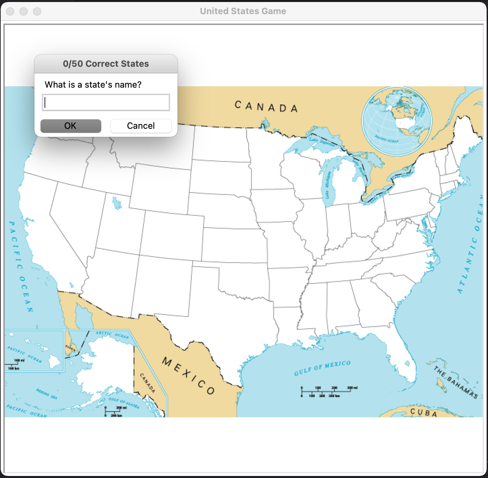
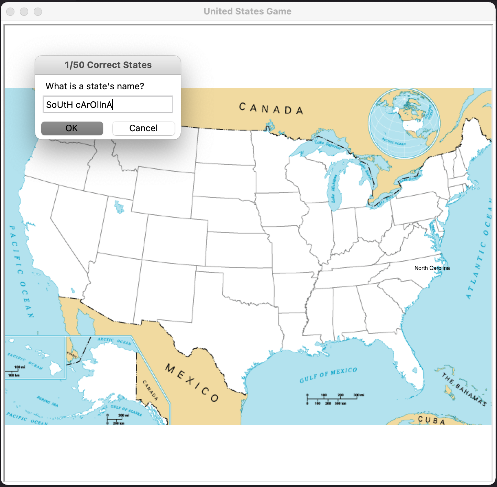
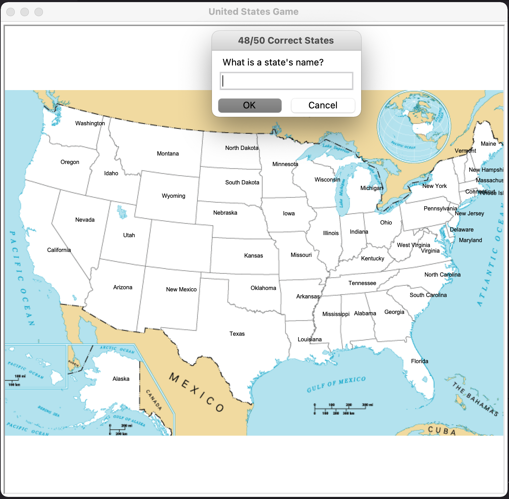

# 50 States
'50 States' (I was sorely tempted to call it "Fifty's Dates") is written in Python and uses the Turtle module as well as the Pandas modules to create a guessing game to help people learn the 50 States of the US.

## Gameplay
'50 States' generates a blank map of the United States. A pop-up window prompts the user to enter the name of a state. Spelling is critical here; an answer of 'New Yrk' will not register, however capitalization (or lack thereof) is not regarded as incorrect. 'new york' will be counted as correct. As the user correctly answers, the name of the state will be typed on the map a that particular state's location. A counter on the title bar of the pop-up window will show how many correct answers have been guessed out of 50. Once all 50 states have been guessed, the game will end. For a user who chooses to exit prematurely, an answer of 'exit' will cause the game to end. A .csv file will be generated of all the states the user failed to guess, giving them something to practice.

## Screenshot

## Roadmap
- Add a celebratory 'You've Won' screen if the user manages to correctly guess all 50 states
- Create a variant of the game to allow for state capitals to be guessed instead
- Further design the background
- Refine the x & y coordinates to center the names better, and spread out the New England states 